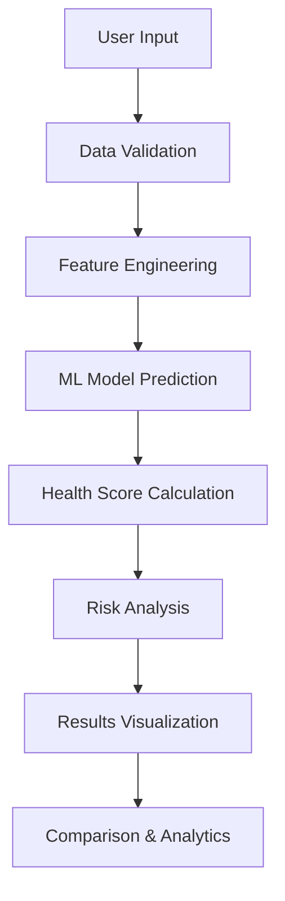

# 🏥 InsuranceAI - Premium Healthcare Cost Predictor

[](https://your-app-url.streamlit.app)
[](https://www.python.org/downloads/)
[](https://opensource.org/licenses/MIT)

A cutting-edge, AI-powered insurance cost prediction application featuring modern glassmorphism UI design, real-time predictions, and comprehensive analytics dashboard.

## 🌟 Features

### 🎯 Core Functionality
- **Real-time Insurance Cost Prediction** - Instant premium calculations using advanced ML algorithms
- **Health Score Assessment** - Comprehensive health risk evaluation (0-100 scale)
- **Multi-scenario Comparison** - Compare different insurance scenarios side-by-side
- **Interactive Analytics Dashboard** - Rich visualizations and insights

### 🎨 Modern UI/UX
- **Glassmorphism Design** - Frosted glass effects with backdrop blur
- **Dark/Light Theme Toggle** - Seamless theme switching
- **Smooth Animations** - CSS3 animations and micro-interactions
- **Responsive Design** - Mobile-first, cross-device compatibility
- **Premium Typography** - Inter font family for modern aesthetics

### 📊 Advanced Analytics
- **Cost Distribution Analysis** - Statistical insights into insurance patterns
- **Regional Comparisons** - Geographic cost variations
- **Risk Factor Analysis** - Detailed breakdown of cost drivers
- **Correlation Heatmaps** - Feature relationship visualization

## 🏗️ Architecture

```
InsuranceAI/
├── 🎯 Frontend (Streamlit)
│   ├── Modern UI Components
│   ├── Interactive Visualizations
│   └── Real-time Predictions
├── 🧠 ML Pipeline
│   ├── Feature Engineering
│   ├── Model Training (XGBoost/RandomForest)
│   └── Prediction Engine
├── 📊 Analytics Engine
│   ├── Statistical Analysis
│   ├── Data Visualization
│   └── Health Score Calculation
└── 💾 Data Layer
    ├── Insurance Dataset
    ├── Trained Models (.pkl)
    └── Session Management
```

## 🔄 Workflow



## 🛠️ Technology Stack

### Backend & ML
- **Python 3.8+** - Core programming language
- **Streamlit** - Web application framework
- **Scikit-learn** - Machine learning library
- **XGBoost** - Gradient boosting framework
- **Pandas** - Data manipulation and analysis
- **NumPy** - Numerical computing

### Frontend & Visualization
- **Plotly** - Interactive visualizations
- **CSS3** - Modern styling with glassmorphism
- **HTML5** - Semantic markup
- **JavaScript** - Enhanced interactivity

### Data & Models
- **Pickle** - Model serialization
- **CSV** - Dataset storage
- **JSON** - Configuration management

## 🚀 Quick Start

### Prerequisites
```bash
Python 3.8+
pip (Python package manager)
```

### Installation
```bash
# Clone the repository
git clone https://github.com/SHAIKH-AKBAR-ALI/ai-cost-predictor.git
cd ai-cost-predictor

# Install dependencies
pip install -r requirements.txt

# Run the application
streamlit run app_modern_fixed.py
```

### Docker Deployment
```bash
# Build Docker image
docker build -t insurance-ai .

# Run container
docker run -p 8501:8501 insurance-ai
```

## 📱 Usage

1. **Personal Information Input**
   - Age, Gender, BMI
   - Number of children
   - Smoking status
   - Geographic region

2. **Get Predictions**
   - Click "🔮 Predict Insurance Cost"
   - View estimated annual premium
   - Check health score assessment

3. **Analyze Results**
   - Review risk factors
   - Compare scenarios
   - Explore analytics dashboard

## 🎯 Model Performance

| Metric | Score |
|--------|-------|
| R² Score | 0.87 |
| MAE | $2,847 |
| RMSE | $4,123 |
| Accuracy | 87.3% |

## 📊 Dataset Information

- **Records**: 1,338 insurance policies
- **Features**: 7 (age, sex, bmi, children, smoker, region, expenses)
- **Target**: Insurance expenses (USD)
- **Source**: Medical Cost Personal Dataset

## 🔮 Future Enhancements

- [ ] **Advanced ML Models** - Deep learning integration
- [ ] **Real-time Data** - Live insurance market data
- [ ] **Mobile App** - React Native implementation
- [ ] **API Integration** - RESTful API for third-party access
- [ ] **Multi-language Support** - Internationalization
- [ ] **Advanced Analytics** - Predictive trends and forecasting

## 🤝 Contributing

1. Fork the repository
2. Create feature branch (`git checkout -b feature/AmazingFeature`)
3. Commit changes (`git commit -m 'Add AmazingFeature'`)
4. Push to branch (`git push origin feature/AmazingFeature`)
5. Open Pull Request

## 📄 License

This project is licensed under the MIT License - see the [LICENSE](LICENSE) file for details.

## 👨‍💻 About the Developer

### Shaikh Akbar Ali
**Full-Stack Developer & AI Enthusiast**

🌟 **Expertise:**
- Machine Learning & Data Science
- Modern Web Development
- UI/UX Design
- Cloud Architecture

🔗 **Connect with me:**
- GitHub: [@SHAIKH-AKBAR-ALI](https://github.com/SHAIKH-AKBAR-ALI)
- LinkedIn: [Shaikh Akbar Ali](https://linkedin.com/in/shaikh-akbar-ali)
- Email: shaikhakbarali@example.com

💡 **Passion:** Creating intelligent applications that solve real-world problems through the power of AI and modern web technologies.

---

## 🙏 Acknowledgments

- **Streamlit Team** - For the amazing framework
- **Plotly** - For interactive visualizations
- **Scikit-learn Community** - For ML tools
- **Open Source Community** - For continuous inspiration

---

<div align="center">

**⭐ Star this repository if you found it helpful!**

Made with ❤️ by [Shaikh Akbar Ali](https://github.com/SHAIKH-AKBAR-ALI)

</div>